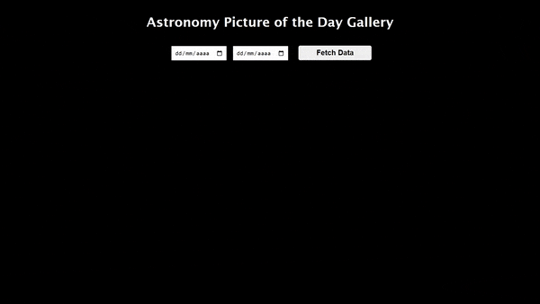

# nasa-web-app

The Nasa Web App is a web application that uses the NASA Astronomy Picture of the Day (APOD) API to display a gallery of astronomical images. 

## Table of contents
- [Demo](#demo)
- [Features](#features)
- [Technologies Used](#technologies-used)
- [Installation](#installation)
- [Usage](#usage)

## Demo
A live demo can be seen using this [link](https://nasa-web-app.vercel.app/).



## Features
- Fetch and display images from the NASA APOD API based on user-defined date ranges.
- Responsive design suitable for desktop, tablet and mobile devices.
- Checkbox filters for selecting specific categories.
- Each image displays its title on hover for quick information.
- Detailed information displayed upon clicking an image.

## Technologies Used
- **Frontend:** React, CSS, HTML
- **Backend:** Node.js Express
- **APIs:** [NASA Astronomy Picture of the Day API](https://github.com/nasa/apod-api).

## Installation
To run the project locally, follow these steps:
1. Clone the repository:
    ```bash
    git clone https://github.com/marcialeite24/nasa-web-app.git 
    ```
2. Navigate to the project directory:
    ```bash
    cd nasa-web-app\frontend
    ```
3. Install the necessary dependencies:
    ```bash
    npm install
    ```
4. Start the project:
    ```bash
    npm start
    ```

## Usage
- Enter a date range in the specified input fields (Start date must be before end date and end date must be today or earlier). 
- Click the "Fetch Data" button to retrieve the images based on your date range selection.
- Select the desired filters using the checkboxes.
- Hover over images to see their titles displayed for quick information (only available on desktop), and click on an image to view additional details (title, explanation, date).